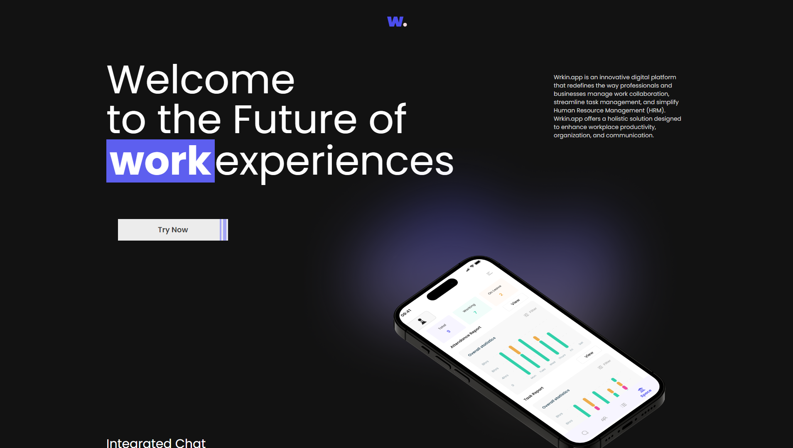
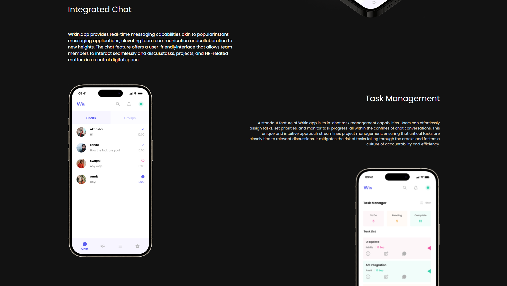
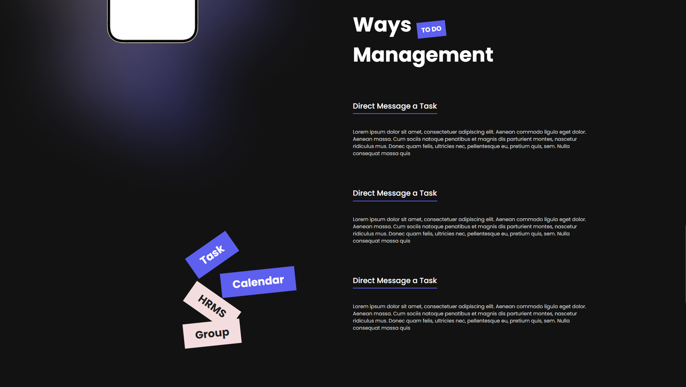
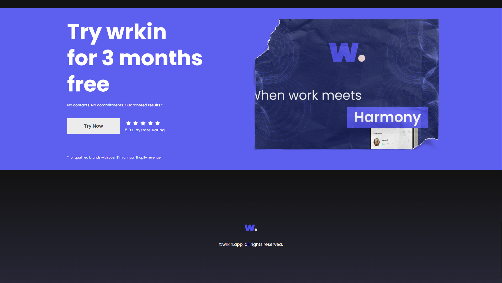

# Wrkin.app

Wrkin.app is an innovative digital platform that redefines the way professionals and businesses manage work collaboration, streamline task management, and simplify Human Resource Management (HRM). Wrkin.app offers a holistic solution designed to enhance workplace productivity, organization, and communication.

## [Demo Link](https://wrkin-web.vercel.app/) 🔗

## Screenshots 📷📸

  
  
  
  
  
   

## Technologies used 🛠️

- **HTML** 🚀
- **CSS** 🚀
- **JavaScript** 🚀
- **Tailwind CSS** 🚀
- **React JS** 🚀

---

## Developer 👨‍💻

- **Vivek Khanal** - **[Linkedin](https://www.linkedin.com/in/vivek-khanal-793016231/)**, **[Github](https://github.com/dev-vivekkhanal)**, **[Portfolio](https://vivekkhanal.com)**

---
